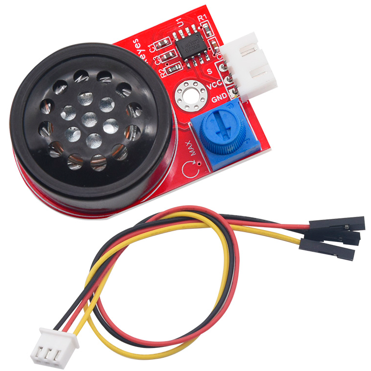
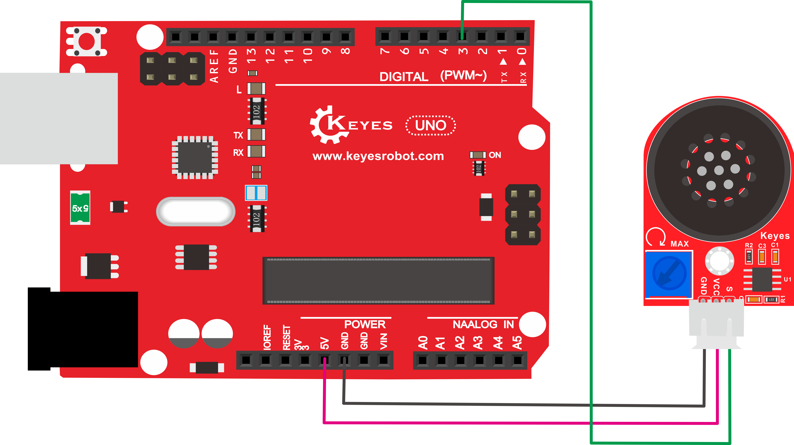
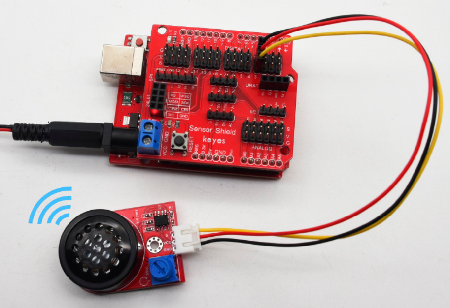

# KE2072 Keyes Brick 功放模块（8002B芯片）综合指南



---

## 1. 简介
KE2072是一个基于8002B芯片的音频功放模块，主要用于放大微弱的音频信号。该模块配备一个可调电位器和一个小功率喇叭，能够将输入的音频信号放大约8.5倍，并通过喇叭播放出来。它可以作为音乐播放设备的外接扩音设备，适用于各种DIY音响项目和智能家居设备。

在使用时，请注意先将音量调至最小，然后逐渐增大，以防止烧坏喇叭。该模块兼容多种单片机控制板，如Arduino系列，用户可以通过堆叠传感器扩展板来简化连接。

---

## 2. 特点
- **高增益**：可将输入音频信号放大约8.5倍，适合小型音响系统。
- **可调音量**：内置可调电位器，方便用户调节音量大小。
- **防反插设计**：模块配备防反插白色端子，方便连接，避免接线错误。
- **小巧轻便**：模块尺寸小，适合嵌入式应用和DIY项目，便于集成到各种设备中。
- **兼容性强**：支持多种单片机控制，易于与其他模块配合使用。

---

## 3. 规格参数
- **工作电压**：DC 5V  
- **工作电流**：≥500mA  
- **最大功率**：2W  
- **工作温度**：0-40℃  
- **尺寸**：49mm x 31mm x 15.6mm  
- **喇叭功率**：0.15W  
- **喇叭声音**：80dB  
- **放大芯片**：SC8002B  

---

## 4. 工作原理
KE2072模块通过8002B芯片对输入的音频信号进行放大处理。用户可以将音频信号输入到模块的音频输入端，模块将信号放大并通过内置喇叭播放。用户可以通过调节电位器来控制音量，确保音质清晰且不失真。

### 工作流程：
1. **输入信号**：将音频信号输入到模块的音频输入端。
2. **信号放大**：8002B芯片对输入信号进行放大处理。
3. **输出信号**：放大后的信号通过喇叭输出，驱动喇叭发声。

---

## 5. 接口
| 序号 | 名称 | 说明 |
|------|------|------|
| 1    | VCC  | 电源输入（DC 5V） |
| 2    | GND  | 地线 |
| 3    | S    | 音频输入信号（连接单片机数字引脚） |
| 4    | OUT  | 音频输出信号（连接喇叭） |

---

## 6. 连接说明
1. **连接 VCC 引脚**：
   - 将模块的 **VCC** 引脚连接到 **5V 电源**。确保电源能够提供稳定的5V电压，以保证模块正常工作。

2. **连接 GND 引脚**：
   - 将模块的 **GND** 引脚连接到 **地线**。确保地线连接良好，以避免信号干扰。

3. **连接 S 引脚**：
   - 将模块的 **S** 引脚连接到单片机的 **数字引脚**。这个引脚用于接收音频信号或控制信号，确保连接到正确的数字引脚，以便单片机能够控制模块的工作。

### 连接示意图
以下是连接示意图的描述（请根据实际情况绘制或参考）：



---

## 7. 示例代码
以下是使用Arduino控制音频输出的示例代码：
```cpp
#define D0 -1
#define D1 262
#define D2 293
#define D3 329
#define D4 349
#define D5 392
#define D6 440
#define D7 494
#define M1 523
#define M2 586
#define M3 658
#define M4 697
#define M5 783
#define M6 879
#define M7 987
#define H1 1045
#define H2 1171
#define H3 1316
#define H4 1393
#define H5 1563
#define H6 1755
#define H7 1971

// 列出全部D调的频率
#define WHOLE 1
#define HALF 0.5
#define QUARTER 0.25
#define EIGHTH 0.125
#define SIXTEENTH 0.0625

// 列出所有节拍
int tune[] = {
  M3, M3, M4, M5,
  M5, M4, M3, M2,
  M1, M1, M2, M3,
  M3, M2, M2,
  M3, M3, M4, M5,
  M5, M4, M3, M2,
  M1, M1, M2, M3,
  M2, M1, M1,
  M2, M2, M3, M1,
  M2, M3, M4, M3, M1,
  M2, M3, M4, M3, M2,
  M1, M2, D5, D0,
  M3, M3, M4, M5,
  M5, M4, M3, M4, M2,
  M1, M1, M2, M3,
  M2, M1, M1
};

float durt[] = {
  1, 1, 1, 1,
  1, 1, 1, 1,
  1, 1, 1, 1,
  1 + 0.5, 0.5, 1 + 1,
  1, 1, 1, 1,
  1, 1, 1, 1,
  1, 1, 1, 1,
  1 + 0.5, 0.5, 1 + 1,
  1, 1, 1, 1,
  1, 0.5, 0.5, 1, 1,
  1, 0.5, 0.5, 1, 1,
  1, 1, 1, 1,
  1, 1, 1, 1,
  1, 1, 1, 0.5, 0.5,
  1, 1, 1, 1,
  1 + 0.5, 0.5, 1 + 1,
};

int length;
int tonepin = 3; // 使用3号接口

void setup() {
  pinMode(tonepin, OUTPUT);
  length = sizeof(tune) / sizeof(tune[0]); // 计算长度
}

void loop() {
  for (int x = 0; x < length; x++) {
    tone(tonepin, tune[x]);
    delay(500 * durt[x]); // 根据节拍调节延时
    noTone(tonepin);
  }
  delay(2000);
}
```

---

## 8. 实验现象



在成功连接模块并上传代码后，用户可以观察到喇叭发出《欢乐颂》的旋律。通过旋转电位器，用户可以调节声音的大小，确保音质清晰且不失真。

### 实验步骤：
1. 连接模块并上传代码。
2. 确保音频信号源连接正确。
3. 观察喇叭的音频输出，确认其能够正常工作。

---

## 9. 注意事项
- **电源要求**：确保模块连接的电源电压为5V，以避免损坏模块。
- **负载匹配**：确保连接的喇叭功率与模块输出匹配（通常为0.15W）。
- **音量控制**：使用时先将音量调至最小，然后逐渐增大，以防止烧坏喇叭。
- **散热**：在高功率输出时，确保模块有良好的散热条件。
- **连接方式**：确保音频信号源和喇叭连接正确，避免短路。

---

## 10. 参考链接
- [Keyes官网](http://www.keyes-robot.com/)
- [8002B 功放芯片数据手册](https://www.datasheetarchive.com/)
- [Arduino 音频处理教程](https://www.arduino.cc/en/Tutorial/Audio)