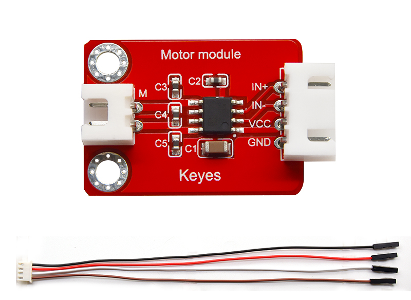
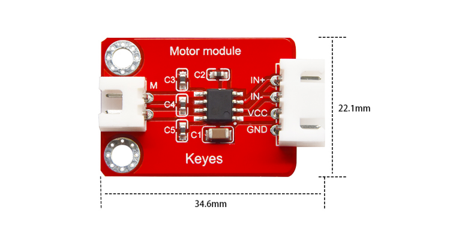
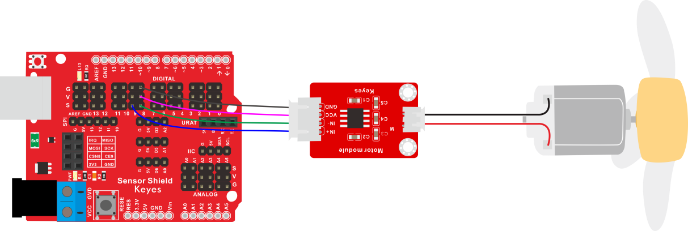
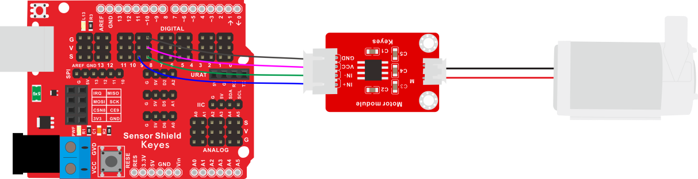
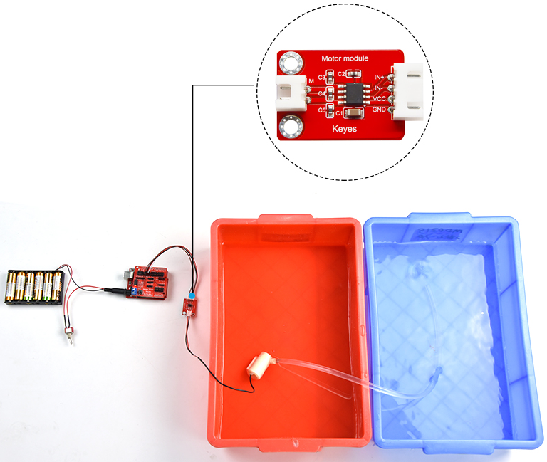

# KE2073 Keyes 130电机-DC3-5V浇花小水泵驱动模块综合指南



---

## 1. 概述
在生活中，我们经常需要驱动一个风扇转动或者一个小水泵。为了方便接线，我们特别设计了 **130电机-DC3-5V浇花小水泵驱动模块**。模块采用 **HR1124S** 电机控制芯片。HR1124S是应用于直流电机方案的单通道H桥驱动器芯片。HR1124S的H桥驱动部分采用低导通电阻的PMOS和NMOS功率管，保证芯片低的功率损耗，使得芯片安全工作更长时间。此外，HR1124S拥有低待机电流和低静态工作电流，这些性能使HR1124S易用于玩具方案。

使用时，只需要将水泵或130电机两端连接在模块的2pin接口上，同时，模块的4pin接口用于连接对应单片机，用于控制电机或水泵状态。为了方便接线，我们还配送1根4pin线，线的一端为白色防反插接口（和模块上防反插白色端子匹配），另一端为4pin杜邦线母头接口。

模块兼容各种单片机控制板，如Arduino系列单片机。使用时，我们可以在单片机上堆叠一个传感器扩展板。模块和自带导线连接，然后连接在传感器扩展板上，简单方便。同时，模块自带2个直径为3mm的定位孔，方便你将模块固定在其他设备。

---

## 2. 规格参数
- **导线长度**：200mm  
- **工作电压**：DC 1.8V - 6.8V  
- **工作电流**：低待机电流 0.01uA、低静态工作电流 0.2mA、连续输出电流 1.2A  
- **内阻**：低RDS(ON)电阻（0.3Ω）  
- **工作温度范围**：-10℃ 到 +50℃  
- **接口**：间距为2.54mm 4pin防反接口  
- **定位孔大小**：直径为3mm  
- **尺寸**：22.1mm x 34.6mm x 9.3mm  
- **重量**：3g  



---

## 3. 连接图
### 电机接线图



### 水泵接线图



---

## 4. 测试代码

### 电机控制代码：
```cpp
void setup() {
  // 设置电机引脚为输出
  pinMode(8, OUTPUT);
  pinMode(9, OUTPUT);
}

void loop() {
  // 逆时针转
  digitalWrite(8, LOW);
  digitalWrite(9, HIGH);
  delay(2000);
  // 停止
  digitalWrite(8, LOW);
  digitalWrite(9, LOW);
  delay(1000);
  // 顺时针转
  digitalWrite(8, HIGH);
  digitalWrite(9, LOW);
  delay(2000);
  // 停止
  digitalWrite(8, LOW);
  digitalWrite(9, LOW);
  delay(1000);
}
```

### 水泵控制代码：
```cpp
void setup() {
  // 设置水泵引脚为输出
  pinMode(8, OUTPUT);
  pinMode(9, OUTPUT);
}

void loop() {
  // 开水泵
  digitalWrite(8, HIGH);
  digitalWrite(9, LOW);
  delay(3000);
  // 关水泵
  digitalWrite(8, LOW);
  digitalWrite(9, LOW);
  delay(1000);
}
```

---

## 5. 代码说明
### 代码1说明：
将管脚设置为D8、D9，当D8输出为低电平，D9输出为高电平时，电机逆时针旋转；当D8输出为高电平，D9输出为低电平时，电机顺时针旋转；当两个管脚都设置为低电平时，电机停止转动。

### 代码2说明：
当D8输出为高电平，D9输出为低电平时，水泵工作（两个引脚的电平输出反过来也行，这个水泵没有正负极）；当D8、D9都输出低电平时水泵停止工作。

---

## 6. 测试结果
烧录好测试130电机代码，按照接线图连接好线；上电后，风扇逆时针转动2秒，停止1秒，顺时针转动2秒，停止1秒，循环交替。

烧录好测试小水泵代码，按照接线图连接好线；将小水泵放入水中，上电后，水泵抽水3秒，停止1秒，循环交替。



---

## 7. 注意事项
- **电源要求**：确保模块连接的电源电压在1.8V - 6.8V范围内，以避免损坏模块。
- **电流限制**：最大连续输出电流为1.2A，确保电源能够提供足够的电流。
- **散热**：在长时间工作时，注意电机的温度，避免过热。
- **连接方式**：确保电源和控制信号连接正确，避免短路。

---

## 8. 参考链接
- [Keyes官网](http://www.keyes-robot.com/)
- [HR1124S 电机控制芯片数据手册](https://www.datasheetarchive.com/)
- [Arduino 控制电机和水泵教程](https://www.arduino.cc/en/Tutorial/HomePage)