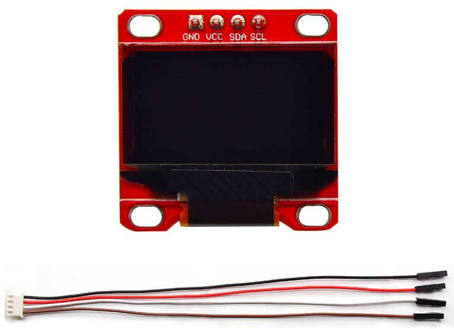
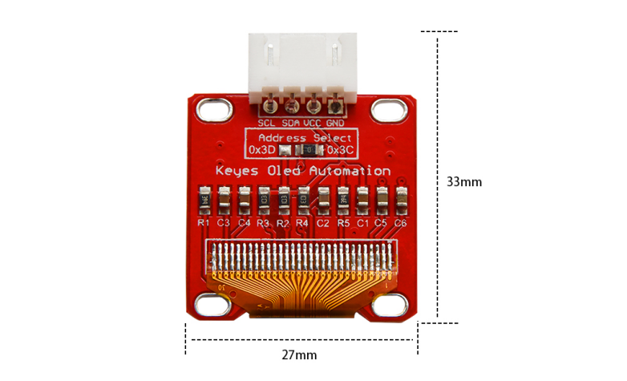
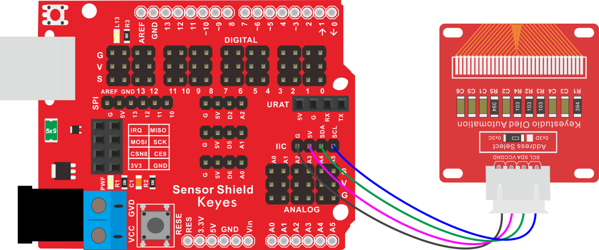
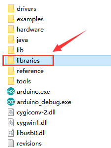
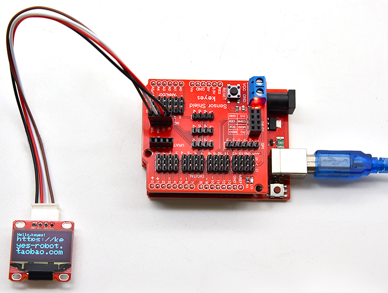

# KE2074 Keyes Brick 0.96寸高亮高清晰 IIC通信 OLED显示屏综合指南



---

## 1. 概述
OLED是有机发光二极管，又称为有机点激光显示。OLED显示技术具有自发光特性，它采用非常薄的有机材料涂层和玻璃基板，当有电流通过时，这些有机材料就会发光。OLED显示屏可视角度大、功耗低。OLED同时具备自发光、不需背光源（只上电是不会亮的，驱动程序和接线正确才会亮）、对比度高、厚度薄、视角广、反应速度快、可用于挠曲面版、使用温度范围广、结构及制程简单等优异特性。模块自带4个定位孔，方便你将模块固定在其他设备。

为了方便接线，我们还配送1根4pin线，线的一端为白色防反插接口（和模块上防反插白色端子匹配），另一端为4pin杜邦线母头接口。模块兼容各种单片机控制板，如Arduino系列单片机。使用时，我们可以在单片机上堆叠一个传感器扩展板。模块和自带导线连接，然后连接在传感器扩展板上，简单方便。同时，模块自带2个直径为3mm的定位孔，方便你将模块固定在其他设备。

---

## 2. 规格参数
- **导线长度**：200mm  
- **工作电压**：DC 5V  
- **接口**：间距为2.54mm 4pin防反接口  
- **通信方式**：I2C通信  
- **内部驱动芯片**：SSD1306  
- **分辨率**：128 x 64 像素  
- **尺寸**：33mm x 27mm x 9.2mm  
- **重量**：4.3g  



---

## 3. 连接图
以下是连接示意图的描述（请根据实际情况绘制或参考）：



---

## 4. 测试代码
以下是使用Arduino控制OLED显示屏的示例代码：
```cpp
#include <SPI.h>
#include <Wire.h>
#include <Adafruit_GFX.h>
#include <Adafruit_SSD1306.h>

#define OLED_RESET 4
Adafruit_SSD1306 display(OLED_RESET);

void setup() {
  // 初始化显示屏
  display.begin(SSD1306_SWITCHCAPVCC, 0x3C); // 初始化I2C地址为0x3C
  display.display(); // 显示初始化画面
  delay(2000); // 延时2秒
  display.clearDisplay(); // 清空显示
}

void loop() {
  display.clearDisplay(); // 清空显示
  display.setTextSize(1); // 设置文本大小
  display.setTextColor(WHITE); // 设置文本颜色
  display.setCursor(0, 0); // 设置光标位置
  display.println("Hello, keyes!"); // 显示文本
  display.setTextSize(2); // 设置文本大小
  display.println("https://keyes-robot.taobao.com"); // 显示网址
  display.display(); // 更新显示
  delay(250); // 延时250毫秒
}
```

### 特别注意：
代码中调用了库文件，上传代码前需要将带有库文件的文件夹复制到 `libraries` 文件夹中。然后重启Arduino IDE，否则无效。



---

## 5. 测试结果
烧录好测试代码，按照接线图连接好线；上电后，OLED显示屏显示如下图：



---

## 6. 相关资料链接

- [Keyes官网](http://www.keyes-robot.com/)
- [Adafruit SSD1306 库](https://github.com/adafruit/Adafruit_SSD1306)
- [Arduino I2C 通信教程](https://www.arduino.cc/en/Reference/Wire)
- [百度网盘资料](https://pan.baidu.com/s/1eyzizCMiftM7uogfkSrzIg) 提取码：499g